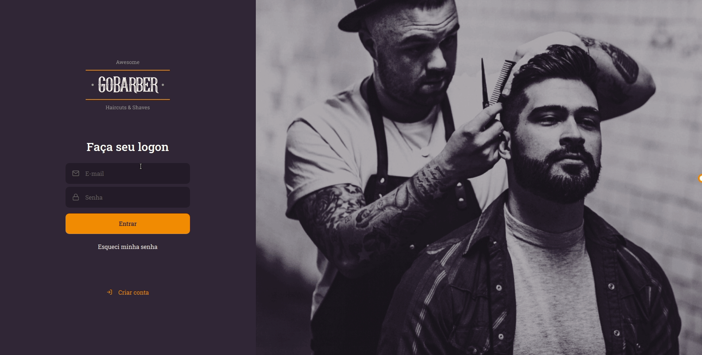
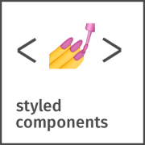

   

# GoBarber
This repository's part of my web studies with Rocketseat Bootcamp (GoStack).

---
## About
GoBarber it's a fictitious platform to find and offer barbershop services available on web and mobile.
This is the major project from the Bootcamp and intents to practice some technologies and concepts I've learned during the course like __React.js__, __React Native__, __Node.js__, __SOLID__, and __Automatic tests__.

---
### Project status

- [x] Backend
- [x] Web Barber page
- [x] Customer app
---
## Preview

   

      
   

   

      
   

---

## Build with

   
   
   
   
   
   

   

   

   

   

   

   

   

   

 
  
  
  

