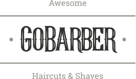

   

# GoBarber
This repository its part of my web studies with Rocketseat bootcamp (GoStack).

---
## About
GoBarber its a fictitious platform to find and offer barbershop services avaliable in web and mobile. 
This is the major project from
the bootcamp and intents to pratice some technologies and concepts I've learn during the course like __React.js__, __React Native__, __Node.js__, __SOLID__ and __Automatic tests__.

---

